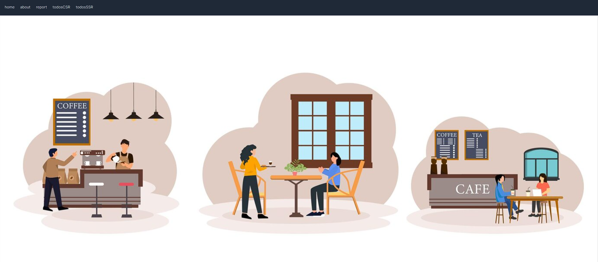

## 📝TodoList with next.js

- next.js의 렌더링을 각 페이지마다 구현하였습니다.
- tailwind CSS를 이용하여 디자인을 진행하였습니다.
- json-server를 통해 가벼운 DB를 구현하였습니다.

### TodosCSR

> - components/TodoForm과 components/TodoRender
>   에서 훅과 컴포넌트를 관리하고 있습니다.
> - Route Handler를 이용하여 DB를 관리하였습니다.
> - useRouter를 이용하여 report 페이지로의 이동을 구현하였습니다.

### TodosSSR

> - SSR을 이용하여 db.json에서 직접 자료를 받고 있습니다.
> - Link를 이용하여 report 페이지로의 이동을 구현하였습니다.

### report

> ISR을 이용하여 10초의 주기마다 TodoList의 목록을 각각
> 총 리스트의 숫자, 할 일 숫자, 완료한 일 숫자로 구분하고 있습니다.

### about

> SSG를 이용하여 소개페이지를 구현하였습니다.

---

### 🎨Tailwind를 이용한 디자인

> - sticky 속성을 이용한 네비게이션 바를 제작하였습니다.
> - about page와 report page에서 absolute 속성을 이용하여 위치를 조정하였습니다.
> - hover와 와 cursor에 각각의 위치에 맞는 속성을 부여해 ux를 향상하였습니다.

---

### 🛠️문제와 해결

> - SSR과 CSR을 구현하는 과정에서 데이터를 가져오는 과정에서 문제가 발생하였습니다. build를 실패하는 과정이 존재하였습니다.
>
> - build가 되지 않는 이유는, route Handler를 이용한 과정에서 발생하였기 때문에 해당하는 문제 해결을 위해서 TodosCSR 구현에서만 부분적으로 route Handler를 이용하였고, TodosSSR에서는 직접 db.json을 연결하였습니다.
>
> - SSG에서 구현한 데이터가 갱신되지 않는 문제가 발생하였습니다.
> - 이 문제는 브라우저캐시를 초기화하면서 고칠 수 있었습니다. 또한 route Handler를 사용하지 않고 직접 db.json을 연결하여 추가적인 문제가 발생하지 않게 되었습니다.
